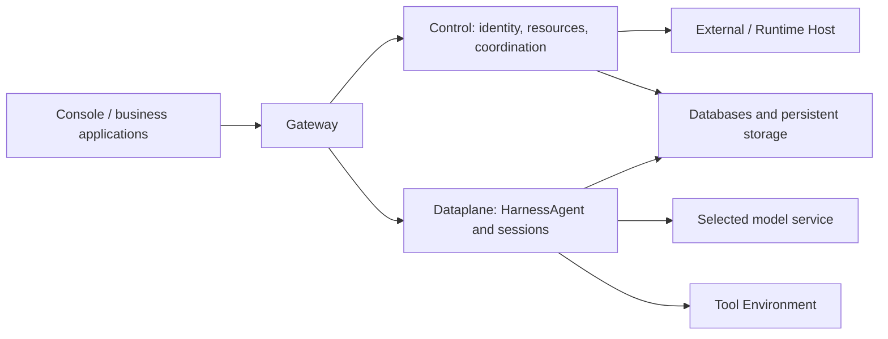

<Note>
This guide uses the `2.1.0-BETA1` prerelease. Validate it for your environment before production use.
</Note>

Self-hosting is currently the primary recommended deployment approach. This tutorial uses Docker Compose to start the complete Service platform on your machine or server. Once it is running, connect a model and select a tool execution environment available to your account so that you can run Managed Agents built on HarnessAgent. After completing this page, create your first Agent and verify execution with an actual task.

If your team already provides Service, start at step 3 to sign in with your account and select an authorized namespace; you do not need to deploy another platform. For Kubernetes, complete the [installation guide](/v2/en/service/kubernetes) first, then return here to prepare your API identity and execution environment. The [self-hosted architecture section](/v2/en/service/quickstart#self-hosting) later on this page explains how platform components relate to execution resources.

<span id="1-start"></span>
<span id="2-sign-in"></span>
<span id="3-configure-execution"></span>

## Prepare

The deployment commands require Docker Engine or Docker Desktop and Compose v2. After installation, run `docker info` and `docker compose version` to check that Docker is available and Compose works. The initialization script uses OpenSSL to generate secrets, and the later API examples use Bash, curl, and jq. Install these tools on the machine where you will run the commands.

Prepare access credentials for a model that supports tool calls so the platform can execute Agent tasks. CPU, memory, and persistent disk requirements depend on the number of concurrent tasks and the tools they use; allocate resources for your expected workload.

This guide uses the published `2.1.0-BETA1` prerelease and Docker Compose. It does not require a source checkout, Java, Maven, Go or a separately installed CLI. Download the Compose bundle and checksum manifest, then verify only the bundle you downloaded:

```bash
curl -fLO https://github.com/agentscope-ai/agentscope-java/releases/download/v2.1.0-BETA1/agentscope-service-2.1.0-BETA1-compose.tar.gz
curl -fLO https://github.com/agentscope-ai/agentscope-java/releases/download/v2.1.0-BETA1/SHA256SUMS
awk '$2 == "agentscope-service-2.1.0-BETA1-compose.tar.gz"' SHA256SUMS > compose.sha256
if command -v sha256sum >/dev/null 2>&1; then
  sha256sum -c compose.sha256
else
  shasum -a 256 -c compose.sha256
fi
```

The package starts PostgreSQL and four Service images from `sca-registry.cn-hangzhou.cr.aliyuncs.com/agentscope`: `as-controlplane` (including Dashboard), `as-gateway`, `as-dataplane`, and `as-scheduler`, all tagged `2.1.0-BETA1`. Docker chooses the matching `linux/amd64` or `linux/arm64` image. For a Kubernetes production installation, use the [Helm guide](/v2/en/service/kubernetes).

## 1. Initialize deployment and configure a model

Extract the downloaded package, enter its `agentscope-service` directory, and run the initialization script. It uses the version and image repository you provide to generate the deployment configuration.

```bash
tar -xzf agentscope-service-2.1.0-BETA1-compose.tar.gz
cd agentscope-service
./init-env.sh 2.1.0-BETA1 sca-registry.cn-hangzhou.cr.aliyuncs.com/agentscope
```

The initialization script creates `.env` with mode `600`, allowing its owner to read and modify the configuration. This file contains the database password and authentication secrets needed to start the platform, together with the Vault encryption key and initial administrator password. If `.env` already exists, the script preserves it, so repeating initialization does not update the version or reset passwords.

For an initial evaluation on a trusted local machine, edit `.env` to supply your model credential and allow the Local tool environment. Replace `YOUR_MODEL_CREDENTIAL` below with your own credential.

```dotenv
DASHSCOPE_API_KEY=YOUR_MODEL_CREDENTIAL
BUILDER_ALLOW_LOCAL_ENVIRONMENT=true
```

The standard distribution uses the deployment’s default model. Other providers require the appropriate extensions and configuration, as described in [model connections](/v2/en/service/managed-agent-configuration#model-integrations). The model connection enables Agent reasoning; the tool execution environment determines where the file and command tools called during that reasoning run.

The Local environment enabled here runs tools inside the Dataplane container. Tools can therefore access files available in that container, and host directories are not mounted automatically. For a separate sandbox or remote execution resource, keep Local disabled, prepare the resource through the [Environment guide](/v2/en/service/environments), and select it in step 4.

## 2. Start and sign in

After saving the configuration, pull the images and start the Compose services. These commands wait for the components to become ready, list their status, and check Gateway’s health endpoint so you can confirm that the platform has started.

```bash
docker compose pull
docker compose up -d --wait --wait-timeout 600
docker compose ps
curl -fsS http://localhost:18080/actuator/health
```

Once the components are healthy, open `http://localhost:18080` in your browser. On a new deployment, sign in as `admin` with the value of `CONTROL_PLANE_BOOTSTRAP_PASSWORD` from `.env`, then change the password in Profile. The initial administrator is created only when the user database is empty, so restarting an existing deployment does not reset its accounts or restore the initial password.

## 3. Prepare API identity and namespace

The tutorials create and call resources through APIs, so first obtain a platform user token. Run the following commands in one Bash terminal, setting `BASE_URL` to the actual Service address, and enter your account credentials when prompted. For the new administrator account, use the password you set in Profile. The commands save the login token as `TOKEN` and query the namespaces available to that account.

```bash
export BASE_URL='http://localhost:18080'
read -r -p 'Username: ' LOGIN_USER
read -r -s -p 'Password: ' LOGIN_PASSWORD
printf '\n'
TOKEN=$(jq -n --arg username "$LOGIN_USER" --arg password "$LOGIN_PASSWORD" \
  '{username:$username,password:$password}' \
  | curl --fail-with-body -sS "$BASE_URL/api/auth/login" \
      -H 'Content-Type: application/json' --data-binary @- | jq -er '.token')
unset LOGIN_PASSWORD
export TOKEN

curl --fail-with-body -sS "$BASE_URL/api/v1/me/namespaces" \
  -H "Authorization: Bearer $TOKEN" | jq '.items[] | {tenant, name, kind, roles}'

export TENANT='YOUR_TENANT'
export NAMESPACE='YOUR_NAMESPACE'
```

Choose a namespace from the query results for this exercise. Replace the `TENANT` placeholder with that entry’s `tenant` and `NAMESPACE` with its `name`. Accounts may have access to different namespaces, so use the actual response. Creating Agents and Environments and calling Sessions require the corresponding permissions in that namespace. If your account lacks them, ask an administrator to grant access according to [accounts and permissions](/v2/en/service/access).

Here, `TOKEN` represents the signed-in platform user and is used for resource management. When publishing for a business application, you can issue a separate Application API key for the caller. Their purposes and interfaces differ, as the application integration guide explains. Keep the variables in this terminal for the following steps.

## 4. Prepare tool execution

An Agent needs an available Environment to run tools such as file readers and writers. First query the environments already provided in your namespace. If one suits this exercise, assign its `id` to `ENVIRONMENT_ID` and skip the creation command below.

```bash
curl --fail-with-body -sS "$BASE_URL/api/environments" \
  -H "Authorization: Bearer $TOKEN" \
  -H "X-AgentScope-Tenant: $TENANT" -H "X-AgentScope-Namespace: $NAMESPACE" \
  | jq '.[] | {id, name, type}'

export ENVIRONMENT_ID='CHOSEN_ENVIRONMENT_ID'
```

If this is a new evaluation deployment without an available environment, and you enabled Local execution in step 1, run the following command to create a Local Environment. It extracts the new environment’s ID from the response and saves it as `ENVIRONMENT_ID`.

```bash
ENVIRONMENT_JSON=$(curl --fail-with-body -sS "$BASE_URL/api/environments" \
  -H "Authorization: Bearer $TOKEN" -H 'Content-Type: application/json' \
  -H "X-AgentScope-Tenant: $TENANT" -H "X-AgentScope-Namespace: $NAMESPACE" \
  --data '{"name":"Tutorial local","type":"local","config":{}}')
export ENVIRONMENT_ID=$(printf '%s' "$ENVIRONMENT_JSON" | jq -er '.id')
```

Creating an Environment selects the location for tool execution; the model still uses the connection prepared earlier. In a team deployment, platform administrators normally provide environments that meet isolation and network requirements, and users choose one they are authorized to access. For tasks that need a sandbox or remote host, read the [Environment guide](/v2/en/service/environments) for the corresponding setup.

## 5. Check readiness

Before creating an Agent, use this table to review the preparation steps. These checks establish that the platform and its resources are available. The next tutorial runs a real task to verify that model calls and file tools work together.

| Check | Success criterion |
| --- | --- |
| Service | Compose components are healthy; Gateway accepts login |
| Identity | Valid user token and an authorized tenant / namespace |
| Model | Dataplane has real credentials and an available model |
| Tools | Available `ENVIRONMENT_ID`; dependencies in the actual execution environment |

Once the checks pass, keep your terminal variables and continue to [your first Managed Agent](/v2/en/service/create-managed-agent). If you are currently evaluating the platform, you can return to the production deployment sections after completing that tutorial.

<span id="self-hosting"></span>
<span id="three-deployment-boundaries"></span>
<span id="choose-a-deployment-path"></span>
<span id="hand-over-a-usable-platform"></span>
<span id="operate-the-platform"></span>

## Deployment boundaries and production planning

The preceding Compose commands deploy the complete Service. Users access it through Gateway; Control manages identity and resources and coordinates work; Dataplane runs HarnessAgent and sessions; and Scheduler handles scheduling work. Databases and persistent storage preserve the data these services need. Operating this shared installation is the responsibility that comes with self-hosting the platform.

Tool execution resources can be prepared separately from platform services. Even when file or Shell tools use a sandbox, remote file backend, or `self_hosted` Worker, Dataplane still runs Managed Agent reasoning. Connecting External or Hosted Agents also involves the existing application or Runtime Host. These resources connect to the deployed Service to provide their respective execution capabilities.



After choosing deployment locations, check where each component actually connects. A self-hosted Service can still call a remote model, and its tools may access external systems through MCP or other interfaces. Plan networking around the selected model, tools, and storage to understand where data travels, and provide incoming routes for callbacks such as OAuth when needed.

For local evaluation, continue with Compose. A platform team maintaining a longer-term installation can choose Kubernetes to suit its infrastructure. The table below summarizes the resources required by each path; users of an existing team platform normally need only account and execution-environment setup.

| Path | Current use | Prerequisites |
| --- | --- | --- |
| Docker Compose | Local evaluation, development, and integration | Release bundle, Docker, model credentials, persistent disk |
| Kubernetes / Helm | Installation operated by a platform team | PostgreSQL, shared Workspace storage, Artifact storage, Secrets, domain, and TLS |
| Existing team platform | Direct use by application developers | Service address, account, authorized scope, available model and Environment |

The current complete Service Chart configures one replica per component and uses Recreate updates, so upgrades require a maintenance window. Do not assume this installation provides multi-replica high availability or upgrades without downtime. Kubernetes-native ControlPlane/ASDP is a separate deployment mode for the corresponding SDK and runtime transport requirements; it is not an additional set of mandatory components to install over the complete Service Chart.

When handing the platform over to an application team, administrators provide an accessible Service address and account and explain which Namespace the account can use. Users also need to know whether the default model is ready, which tool environment to select, and where business materials reside and how to access them. With this information, they can verify the model and file tools through [Their first managed Agent](/v2/en/service/create-managed-agent), then check application calls through the [Session API integration guide](/v2/en/service/service-api).

Before production use, verify that users can receive execution events continuously, restore existing content after a page refresh, and download delivered files with the appropriate permissions. If the application relies on Webhooks, confirm that the receiving endpoint gets notifications. Pair database and file backups with recovery exercises, including how unfinished work will be handled. These checks establish that the platform behaves as intended during normal use and recovery.

## Network surfaces

By default, Compose exposes only Gateway at the host address `127.0.0.1:18080`. User requests enter there and are forwarded to internal services, while the other components communicate over the internal network. Their container ports and exposure are listed below.

| Component | Container port | Exposure |
| --- | --- | --- |
| Gateway | 8080 | Host `127.0.0.1:18080` by default |
| Control | 8081 | Internal network |
| Dataplane | 8082 | Internal network |
| Scheduler | 8083 | Internal network |
| PostgreSQL | 5432 | Internal network |

A reverse proxy on the same host can forward requests to `127.0.0.1:18080`. If it runs in another container, its `localhost` refers to the proxy container itself, so configure a shared network or a host address reachable from that container. The public entry point should still target Gateway, with internal services and the database available through the private network.

## Enable remote access

To access the deployment from another device or test public OAuth or Channel callbacks, configure an HTTPS entry point for Gateway. Prepare a domain and TLS certificate, then forward requests through a reverse proxy. Set `BUILDER_OAUTH_PUBLIC_URL` in `.env` to the actual external address, such as `https://agentscope.example.com`. If Gateway also needs a different listening address or port, change `BIND_ADDRESS` and `GATEWAY_PORT`, then recreate the containers to apply the configuration.

Execution progress travels over a long-lived SSE connection, so the proxy needs to forward events promptly, disable event-stream caching, and allow sufficiently long read timeouts. After configuration, verify login and run a task that produces content over time. Check that events arrive incrementally, the page can reconnect after a refresh, and the callbacks your application uses are working.

## Persist data

Compose uses three named volumes for PostgreSQL data, shared Workspaces, and Artifacts. Locate this project’s volumes with `docker volume ls` and include them in your backup policy. When backing up encrypted data, securely preserve the Vault master key from `.env` as well, because recovery still requires the original key.

If tools need business materials from the host, configure explicit directory mounts and give container user `65532:65532` the necessary access. Merely writing a host path in an Agent instruction does not make it available inside the container. First confirm which directory the selected Environment can actually access, then provide that location to the Agent.

## Change configuration or version

After editing `.env`, run the Compose startup command again so services use the new configuration. Check component status afterward to confirm that the updated installation still runs normally.

```bash
docker compose up -d --wait --wait-timeout 600
docker compose ps
```

To upgrade, edit `SERVICE_VERSION` in `.env`, pull the corresponding new images, and restart the services. Initialization preserves an existing `.env`, so rerunning `init-env.sh` does not perform the version change for you. Coordinate any secret change across components that use it. In particular, the Vault master key is needed to decrypt existing data and cannot be replaced like an ordinary login password.

The complete Compose installation uses standalone HTTP. To connect an External SDK that depends on ASDP, prepare its runtime transport according to [External integration](/v2/en/service/external-agent). See [production installation](/v2/en/service/kubernetes) for Kubernetes setup. Whatever deployment you use, rehearse [backup and recovery](/v2/en/service/operations) before upgrading.

## Stop, resume and diagnose

To stop the platform temporarily, run `docker compose down`. It stops services while retaining their data volumes, so the startup command can later resume the installation with its existing data. Do not add `-v` for an ordinary shutdown, because that option also deletes the volumes.

If startup fails, use `docker compose ps -a` to identify the component that did not start, then inspect `docker compose logs --tail=100` to determine whether the problem involves image pulling, database connectivity, or component startup. If the host port is occupied, change `GATEWAY_PORT` in `.env`. If this also changes the public address, update `BUILDER_OAUTH_PUBLIC_URL` accordingly, then recreate the containers.

Once the platform is available, continue to [Run your first Managed Agent](/v2/en/service/create-managed-agent) to check the prepared model and tool environment with an actual task.
