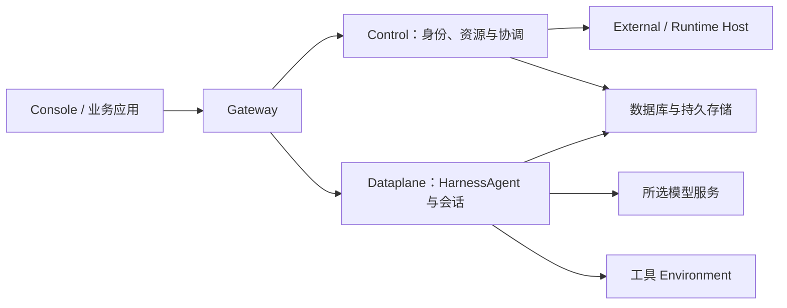

<Note>
本页使用 `2.1.0-BETA1` 预发布版本。用于生产前请验证实际环境。
</Note>

自托管是目前主要推荐的部署方式。本教程使用 Docker Compose，在你的机器或服务器上启动完整的 Service 平台。平台就绪后，你还需要接通模型，并为自己的账号选择可用的工具执行环境，才能运行基于 HarnessAgent 内核的 Managed Agent。完成本页后，就可以继续创建第一个 Agent，通过实际任务验证执行效果。

如果团队已经提供了可用的 Service，你可以直接从第 3 步开始，使用自己的账号登录并选择授权空间，无需再次部署平台。如果计划安装到 Kubernetes，请先按照[安装指南](/v2/zh/service/kubernetes)完成部署，再回到这里准备 API 身份和执行环境。本页后半部分的[自托管架构](/v2/zh/service/quickstart#self-hosting)会进一步解释平台组件与执行资源之间的关系。

<span id="1-启动"></span>
<span id="2-登录"></span>
<span id="3-配置执行能力"></span>

## 准备

部署命令需要 Docker Engine 或 Docker Desktop，以及 Compose v2。安装后，先运行 `docker info` 和 `docker compose version`，确认 Docker 服务可用且 Compose 能正常执行。初始化脚本需要 OpenSSL 来生成密钥，后续 API 示例则使用 Bash、curl 和 jq，请在运行命令的机器上准备好这些工具。

你还需要准备支持工具调用的模型及其访问凭据，供平台执行 Agent 任务。部署所需的 CPU、内存和持久化磁盘取决于并发任务数量与工具负载，应根据实际使用规模安排资源。

本页使用已发布的 `2.1.0-BETA1` 预发布版本，通过 Docker Compose 快速启动。无需下载源码，也无需安装 Java、Maven、Go 或单独的 CLI。下载 Compose 安装包和校验清单，只核对本次下载的安装包：

```bash
curl -fLO https://github.com/agentscope-ai/agentscope-java/releases/download/v2.1.0-BETA1/agentscope-service-2.1.0-BETA1-compose.tar.gz
curl -fLO https://github.com/agentscope-ai/agentscope-java/releases/download/v2.1.0-BETA1/SHA256SUMS
awk '$2 == "agentscope-service-2.1.0-BETA1-compose.tar.gz"' SHA256SUMS > compose.sha256
if command -v sha256sum >/dev/null 2>&1; then
  sha256sum -c compose.sha256
else
  shasum -a 256 -c compose.sha256
fi
```

安装包启动 PostgreSQL，以及 `sca-registry.cn-hangzhou.cr.aliyuncs.com/agentscope` 下的四个 Service 镜像：`as-controlplane`（含 Dashboard）、`as-gateway`、`as-dataplane`、`as-scheduler`，版本均为 `2.1.0-BETA1`。Docker 自动选择对应的 `linux/amd64` 或 `linux/arm64` 镜像。生产环境的 Kubernetes 安装请使用 [Helm 安装指南](/v2/zh/service/kubernetes)。

## 1. 初始化部署并配置模型

解压下载的安装包后，进入其中的 `agentscope-service` 目录，再运行初始化脚本。脚本会根据你传入的版本和镜像仓库生成本次部署使用的配置。

```bash
tar -xzf agentscope-service-2.1.0-BETA1-compose.tar.gz
cd agentscope-service
./init-env.sh 2.1.0-BETA1 sca-registry.cn-hangzhou.cr.aliyuncs.com/agentscope
```

初始化脚本会创建 `.env` 文件，并将权限设为 `600`，使文件所有者能够读取和修改其中的配置。这个文件保存了平台启动所需的数据库密码和认证密钥，也包含 Vault 加密密钥与初始管理员密码。如果 `.env` 已经存在，脚本会保留它，因此重复运行初始化命令不会更新版本或重置密码。

如果这是在可信机器上进行的首次本地体验，可以编辑 `.env`，填入实际的模型凭据，并允许平台使用 Local 工具环境。下面的 `YOUR_MODEL_CREDENTIAL` 需要替换为你自己的凭据。

```dotenv
DASHSCOPE_API_KEY=YOUR_MODEL_CREDENTIAL
BUILDER_ALLOW_LOCAL_ENVIRONMENT=true
```

标准发行包使用部署配置中的默认模型。若要接入其他模型提供方，需要准备相应扩展并完成配置，具体方式见[模型接入](/v2/zh/service/managed-agent-configuration#模型接入)。模型连接准备好后，Agent 才能进行推理；工具执行环境则决定推理过程中调用的文件或命令工具在哪里运行。

本例启用的 Local 环境会在 Dataplane 容器内执行工具，因此工具只能访问容器中可用的文件，主机目录不会自动挂载进去。如果需要更独立的沙箱或远端执行资源，可以保持 Local 关闭，并按 [Environment 指南](/v2/zh/service/environments)准备对应环境，再在第 4 步选择它。

## 2. 启动并登录

配置保存后，先拉取镜像，再启动 Compose 中的服务。下面的命令会等待组件就绪，随后列出运行状态并检查 Gateway 的健康接口，帮助你确认平台是否已经启动。

```bash
docker compose pull
docker compose up -d --wait --wait-timeout 600
docker compose ps
curl -fsS http://localhost:18080/actuator/health
```

确认各组件健康后，在浏览器中打开 `http://localhost:18080`。首次部署可以使用用户名 `admin` 和 `.env` 中 `CONTROL_PLANE_BOOTSTRAP_PASSWORD` 的值登录，然后在 Profile 中修改密码。初始管理员只会在用户库为空时创建，所以重启已有部署不会重置账号或恢复初始密码。

## 3. 准备 API 身份与空间

后续教程通过 API 创建和调用资源，因此需要先取得平台用户令牌。请在同一个 Bash 终端中执行下面的命令，将 `BASE_URL` 设置为实际的 Service 地址，然后按提示输入账号和密码。如果使用的是刚创建的管理员账号，应输入你在 Profile 中修改后的密码。命令会将登录返回的令牌保存为 `TOKEN`，再查询这个账号能够访问的空间。

```bash
export BASE_URL='http://localhost:18080'
read -r -p 'Username: ' LOGIN_USER
read -r -s -p 'Password: ' LOGIN_PASSWORD
printf '\n'
TOKEN=$(jq -n --arg username "$LOGIN_USER" --arg password "$LOGIN_PASSWORD" \
  '{username:$username,password:$password}' \
  | curl --fail-with-body -sS "$BASE_URL/api/auth/login" \
      -H 'Content-Type: application/json' --data-binary @- | jq -er '.token')
unset LOGIN_PASSWORD
export TOKEN

curl --fail-with-body -sS "$BASE_URL/api/v1/me/namespaces" \
  -H "Authorization: Bearer $TOKEN" | jq '.items[] | {tenant, name, kind, roles}'

export TENANT='YOUR_TENANT'
export NAMESPACE='YOUR_NAMESPACE'
```

从查询结果中选择一个用于练习的空间，将 `TENANT` 的占位值替换为该条目的 `tenant`，并将 `NAMESPACE` 替换为同一条目的 `name`。不同账号能访问的空间可能不同，应以实际查询结果为准。后续创建 Agent 和执行环境，以及创建 Session，都需要这个空间中的相应权限；如果账号尚未获准，应按[账号与权限](/v2/zh/service/access)联系管理员完成授权。

这里的 `TOKEN` 代表登录的平台用户，教程会用它执行资源管理操作。业务应用接入时，还可以为调用方单独签发 Application API key；两者的用途和使用接口不同，具体会在应用接入指南中说明。请保留当前终端中的变量，后续步骤会继续使用它们。

## 4. 准备工具执行环境

Agent 执行文件读写等工具时，需要一个可用的 Environment。先运行下面的查询，查看当前空间已经提供的环境。如果其中有适合本次练习的环境，将它的 `id` 填入 `ENVIRONMENT_ID`，就可以跳过后面的创建命令。

```bash
curl --fail-with-body -sS "$BASE_URL/api/environments" \
  -H "Authorization: Bearer $TOKEN" \
  -H "X-AgentScope-Tenant: $TENANT" -H "X-AgentScope-Namespace: $NAMESPACE" \
  | jq '.[] | {id, name, type}'

export ENVIRONMENT_ID='CHOSEN_ENVIRONMENT_ID'
```

如果这是刚启动的体验部署，还没有可用环境，并且已在第 1 步允许 Local 执行，可以运行下面的命令创建一个 Local Environment。命令会从响应中取出新环境的 ID，保存到同一个 `ENVIRONMENT_ID` 变量中。

```bash
ENVIRONMENT_JSON=$(curl --fail-with-body -sS "$BASE_URL/api/environments" \
  -H "Authorization: Bearer $TOKEN" -H 'Content-Type: application/json' \
  -H "X-AgentScope-Tenant: $TENANT" -H "X-AgentScope-Namespace: $NAMESPACE" \
  --data '{"name":"Tutorial local","type":"local","config":{}}')
export ENVIRONMENT_ID=$(printf '%s' "$ENVIRONMENT_JSON" | jq -er '.id')
```

创建 Environment 只是为工具选择执行位置，模型仍使用前面准备的连接配置。团队部署通常由平台管理员提供满足隔离和网络要求的执行环境，使用者选择其中有权限访问的一项即可。如果任务需要在沙箱或远端主机执行，可以进一步阅读 [Environment 指南](/v2/zh/service/environments)，了解相应资源的准备方式。

## 5. 检查是否准备好

继续创建 Agent 前，可以用下表核对前面的准备是否完成。这里检查的是平台及资源是否可用，下一篇教程还会通过真实任务验证模型调用和文件工具能否协同工作。

| 检查 | 成功标准 |
| --- | --- |
| 服务 | Compose 组件健康，Gateway 可登录 |
| 身份 | 用户 token 有效，已选择有权限的 tenant / namespace |
| 模型 | Dataplane 已配置实际凭据与可用模型 |
| 工具环境 | 已保存可用 `ENVIRONMENT_ID`，工具依赖位于实际执行环境 |

检查通过后，保留本终端中的变量，继续[运行第一个托管 Agent](/v2/zh/service/create-managed-agent)。如果目前只是体验平台，可以在完成该教程后再回来阅读生产部署相关内容。

<span id="self-hosting"></span>
<span id="三个不同的部署对象"></span>
<span id="选择部署路径"></span>
<span id="部署后的交接"></span>
<span id="持续运营"></span>

## 部署边界与生产规划

前面的 Compose 命令部署了完整 Service。用户通过 Gateway 访问平台，Control 管理身份和资源并协调工作，Dataplane 运行 HarnessAgent 和会话，Scheduler 承担调度相关工作。数据库和持久存储则保存平台运行所需的数据。维护这套共享服务，是平台自托管时需要承担的运维工作。

工具执行环境可以与平台服务分开准备。即使文件或 Shell 工具运行在沙箱、远端文件后端或 `self_hosted` Worker 中，Managed Agent 的推理过程仍由 Dataplane 承担。接入 External Agent 或 Hosted Agent 时，执行工作还会涉及原有应用或 Runtime Host。这些资源连接到已部署的 Service，分别提供对应的执行能力。



部署位置确定后，还需要检查各组件实际连接到哪里。自托管 Service 仍然可以调用远程模型，工具也可能通过 MCP 或其他接口访问外部系统。规划网络时，应结合所选模型、工具和存储逐一确认数据流向，并为需要从外部到达平台的 OAuth 等回调准备入口。

本地体验可以沿用前面的 Compose 部署；由平台团队长期维护的环境，可以根据基础设施选择 Kubernetes。下表列出各条路径需要准备的资源，已有团队平台的使用者通常只需完成账号和执行环境的准备。

| 路径 | 当前用途 | 需要准备 |
| --- | --- | --- |
| Docker Compose | 本机体验、开发与集成验证 | 发布包、Docker、模型凭据、持久磁盘 |
| Kubernetes / Helm | 由平台团队管理的安装 | PostgreSQL、共享 Workspace 存储、Artifact 存储、Secret、域名与 TLS |
| 已有团队平台 | 应用开发者直接使用 | 服务地址、账号、授权空间、可用模型与 Environment |

当前完整 Service Chart 为每个组件配置一个副本，并采用 Recreate 方式更新，所以升级时需要安排维护窗口，不能据此假定服务具备多副本高可用或无停机升级能力。Kubernetes-native ControlPlane/ASDP 是为相应 SDK 和运行传输提供的另一种部署模式，应根据接入要求选择；它并不是需要叠加到完整 Service Chart 上的一组必装组件。

平台交付给业务团队时，管理员需要提供可访问的 Service 地址和账号，并说明该账号可以使用哪个 Namespace。使用者还需要知道默认模型是否可用、应选择哪个工具环境，以及业务资料放在哪里、如何获得访问权限。有了这些信息，就可以按[第一个托管 Agent](/v2/zh/service/create-managed-agent)完成模型与文件工具验证，再通过[应用接入指南](/v2/zh/service/service-api)检查业务应用的调用过程。

进入生产使用前，应进一步验证用户能否持续接收执行事件、刷新页面后能否恢复已有内容，以及交付文件是否可以按权限下载。如果业务依赖 Webhook，还需确认接收端能够收到通知。数据库和文件备份则需要配合恢复演练，并覆盖未完成工作如何继续处理。这样才能确认平台在实际使用和故障恢复时都能按预期工作。

## 入口与网络

Compose 默认只将 Gateway 暴露在宿主机的 `127.0.0.1:18080`，用户请求由这个入口转发到内部服务。其余组件通过内部网络通信，容器端口及暴露方式如下。

| 组件 | 容器端口 | 暴露方式 |
| --- | --- | --- |
| Gateway | 8080 | 默认宿主 `127.0.0.1:18080` |
| Control | 8081 | 内部网络 |
| Dataplane | 8082 | 内部网络 |
| Scheduler | 8083 | 内部网络 |
| PostgreSQL | 5432 | 内部网络 |

如果反向代理运行在同一台宿主机上，可以将请求转发到 `127.0.0.1:18080`。如果代理运行在另一个容器中，它看到的 `localhost` 指向代理容器自身，因此需要配置共享网络，或使用该容器能够到达的宿主地址。对外入口仍应指向 Gateway，内部组件和数据库通过私网提供服务。

## 启用远程访问

需要从其他设备访问这套部署，或联调 OAuth、Channel 的公网回调时，可以为 Gateway 配置 HTTPS 入口。先准备域名和 TLS 证书，再让反向代理将请求转发到 Gateway。随后在 `.env` 中把 `BUILDER_OAUTH_PUBLIC_URL` 设置为实际的外部地址，例如 `https://agentscope.example.com`；如果 Gateway 还需要调整监听地址或端口，再修改 `BIND_ADDRESS` 和 `GATEWAY_PORT`，并重建容器使配置生效。

执行进度通过 SSE 长连接传输，因此代理需要及时转发事件，关闭事件流缓存，并允许足够长的读取超时。配置完成后，除了确认能够登录，还应运行一次持续生成内容的任务，检查事件是否陆续到达、刷新后能否重新连接，以及业务所需的回调是否正常。

## 数据持久化

Compose 使用三个命名卷分别保存 PostgreSQL 数据、共享 Workspace 和 Artifact。可以通过 `docker volume ls` 找到本项目的卷，并将它们纳入备份策略。备份加密数据时，还必须妥善保留 `.env` 中的 Vault master key，因为恢复这些数据时仍需要原来的密钥。

如果工具需要读取宿主机上的业务资料，应显式配置目录挂载，并保证容器用户 `65532:65532` 具有所需权限。只在 Agent 指令中写出宿主路径，并不会使这个路径出现在容器里。准备资料时，应先确认所选 Environment 实际能够访问哪个目录，再将对应位置提供给 Agent。

## 更新配置和版本

修改 `.env` 后，需要重新执行 Compose 启动命令，让服务使用新的配置。随后检查组件状态，确认更新后仍能正常运行。

```bash
docker compose up -d --wait --wait-timeout 600
docker compose ps
```

升级版本时，应先在 `.env` 中修改 `SERVICE_VERSION`，再拉取对应的新镜像并重新启动服务。初始化脚本会保留已有 `.env`，所以重新运行 `init-env.sh` 不会替你完成这次版本修改。如果需要变更密钥，还应协调使用该密钥的各个组件；尤其是 Vault master key，它关系到已有数据的解密，不能像普通登录密码一样直接替换。

完整 Compose 使用 standalone HTTP 运行方式。如果还要接入依赖 ASDP 的 External SDK，应先按[External 接入说明](/v2/zh/service/external-agent)准备对应的运行通道。生产环境的 Kubernetes 安装方式见[生产安装](/v2/zh/service/kubernetes)，无论采用哪种部署方式，都应在升级前完成[备份恢复演练](/v2/zh/service/operations)。

## 停止、继续与排错

需要暂时停止平台时，可以执行 `docker compose down`。这个命令会停止服务并保留数据卷，之后重新运行启动命令即可继续使用已有数据。日常停止时不要附加 `-v`，因为该参数会同时删除数据卷。

如果启动失败，先用 `docker compose ps -a` 确认哪个组件未正常运行，再通过 `docker compose logs --tail=100` 查看对应错误，判断问题是否发生在镜像拉取、数据库连接或组件启动阶段。如果宿主端口已被占用，可以修改 `.env` 中的 `GATEWAY_PORT`；若对外访问地址也随之变化，还需同步更新 `BUILDER_OAUTH_PUBLIC_URL`，然后重建容器。

平台可用后，继续[运行第一个托管 Agent](/v2/zh/service/create-managed-agent)，通过一次实际任务检查前面准备的模型和工具环境。
